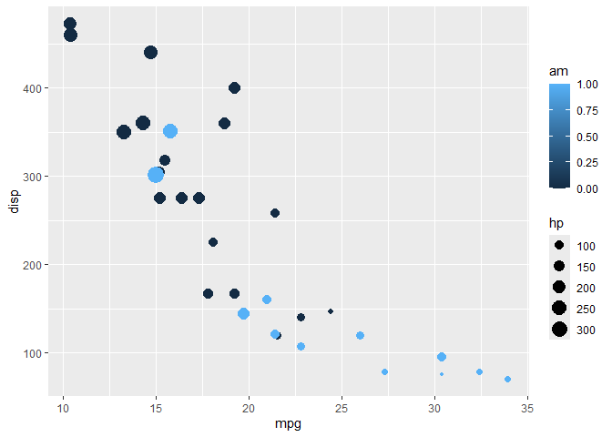
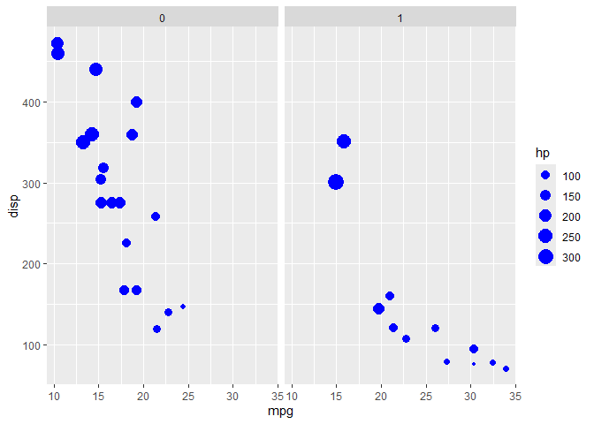
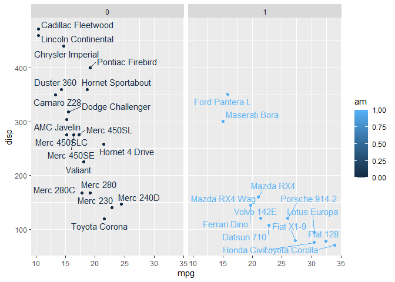
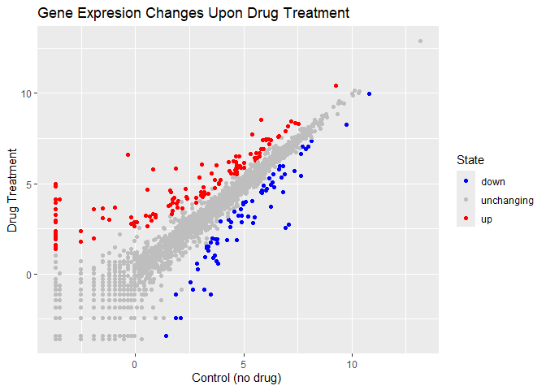

# Class 5: Data Viz with ggplot, 10-16-24
Eli Sobel (PID: A69027989)

There are many ways to make figures and graphs. One that comes with R is
called “base” R, which you use with the `plot()` function.

``` r
plot(cars)
```


A very popular package in this area is called **ggplot2**

Before I can use and add-on package like this, I have to install it.
This can be done as such: `install.packages("ggplot2")`
command/function.

Then to use the package I need to load it with a `library(ggplot2)`
call.

``` r
library(ggplot2)

ggplot(cars) + 
  aes(x=speed,y=dist)+
  geom_point()
```


For “simple” plots like this one, base R code will be much shorter than
ggplot.

Let’s fit a model and show it on my plot.

``` r
library(ggplot2)

ggplot(cars) + 
  aes(x=speed,y=dist) +
  geom_point() +
  geom_smooth()
```

    `geom_smooth()` using method = 'loess' and formula = 'y ~ x'


Every ggplot has at least 3 layers

- **data** (data.frame with the numbers and stuff you want to plot)
- **aes**thetics (mapping of your data columns to your plot)
- **geom**s (there are tons of these - points, lines and columns are
  most common (`geom_point()`, `geom_line()`, `geom_col()`\])

``` r
mtcars
```

                         mpg cyl  disp  hp drat    wt  qsec vs am gear carb
    Mazda RX4           21.0   6 160.0 110 3.90 2.620 16.46  0  1    4    4
    Mazda RX4 Wag       21.0   6 160.0 110 3.90 2.875 17.02  0  1    4    4
    Datsun 710          22.8   4 108.0  93 3.85 2.320 18.61  1  1    4    1
    Hornet 4 Drive      21.4   6 258.0 110 3.08 3.215 19.44  1  0    3    1
    Hornet Sportabout   18.7   8 360.0 175 3.15 3.440 17.02  0  0    3    2
    Valiant             18.1   6 225.0 105 2.76 3.460 20.22  1  0    3    1
    Duster 360          14.3   8 360.0 245 3.21 3.570 15.84  0  0    3    4
    Merc 240D           24.4   4 146.7  62 3.69 3.190 20.00  1  0    4    2
    Merc 230            22.8   4 140.8  95 3.92 3.150 22.90  1  0    4    2
    Merc 280            19.2   6 167.6 123 3.92 3.440 18.30  1  0    4    4
    Merc 280C           17.8   6 167.6 123 3.92 3.440 18.90  1  0    4    4
    Merc 450SE          16.4   8 275.8 180 3.07 4.070 17.40  0  0    3    3
    Merc 450SL          17.3   8 275.8 180 3.07 3.730 17.60  0  0    3    3
    Merc 450SLC         15.2   8 275.8 180 3.07 3.780 18.00  0  0    3    3
    Cadillac Fleetwood  10.4   8 472.0 205 2.93 5.250 17.98  0  0    3    4
    Lincoln Continental 10.4   8 460.0 215 3.00 5.424 17.82  0  0    3    4
    Chrysler Imperial   14.7   8 440.0 230 3.23 5.345 17.42  0  0    3    4
    Fiat 128            32.4   4  78.7  66 4.08 2.200 19.47  1  1    4    1
    Honda Civic         30.4   4  75.7  52 4.93 1.615 18.52  1  1    4    2
    Toyota Corolla      33.9   4  71.1  65 4.22 1.835 19.90  1  1    4    1
    Toyota Corona       21.5   4 120.1  97 3.70 2.465 20.01  1  0    3    1
    Dodge Challenger    15.5   8 318.0 150 2.76 3.520 16.87  0  0    3    2
    AMC Javelin         15.2   8 304.0 150 3.15 3.435 17.30  0  0    3    2
    Camaro Z28          13.3   8 350.0 245 3.73 3.840 15.41  0  0    3    4
    Pontiac Firebird    19.2   8 400.0 175 3.08 3.845 17.05  0  0    3    2
    Fiat X1-9           27.3   4  79.0  66 4.08 1.935 18.90  1  1    4    1
    Porsche 914-2       26.0   4 120.3  91 4.43 2.140 16.70  0  1    5    2
    Lotus Europa        30.4   4  95.1 113 3.77 1.513 16.90  1  1    5    2
    Ford Pantera L      15.8   8 351.0 264 4.22 3.170 14.50  0  1    5    4
    Ferrari Dino        19.7   6 145.0 175 3.62 2.770 15.50  0  1    5    6
    Maserati Bora       15.0   8 301.0 335 3.54 3.570 14.60  0  1    5    8
    Volvo 142E          21.4   4 121.0 109 4.11 2.780 18.60  1  1    4    2

Make me a ggplot of the `mtcars` data set using `mpg` vs `disp`, and set
the size of the points to the `hp`.

``` r
ggplot(mtcars,aes(mpg,disp)) +
  geom_point(aes(size=hp,color=am))
```



Now color all points “blue”

``` r
ggplot(mtcars,aes(mpg,disp,size=hp)) +
  geom_point(color="blue") +
  facet_wrap(~am)
```



``` r
library(ggrepel)

ggplot(mtcars) +
  aes(mpg,disp,col=am,label=rownames(mtcars)) +
  geom_point() +
  facet_wrap(~am) +
  geom_text_repel()
```



``` r
rownames(mtcars)
```

     [1] "Mazda RX4"           "Mazda RX4 Wag"       "Datsun 710"         
     [4] "Hornet 4 Drive"      "Hornet Sportabout"   "Valiant"            
     [7] "Duster 360"          "Merc 240D"           "Merc 230"           
    [10] "Merc 280"            "Merc 280C"           "Merc 450SE"         
    [13] "Merc 450SL"          "Merc 450SLC"         "Cadillac Fleetwood" 
    [16] "Lincoln Continental" "Chrysler Imperial"   "Fiat 128"           
    [19] "Honda Civic"         "Toyota Corolla"      "Toyota Corona"      
    [22] "Dodge Challenger"    "AMC Javelin"         "Camaro Z28"         
    [25] "Pontiac Firebird"    "Fiat X1-9"           "Porsche 914-2"      
    [28] "Lotus Europa"        "Ford Pantera L"      "Ferrari Dino"       
    [31] "Maserati Bora"       "Volvo 142E"         

Get the results of the differential gene expression analysis:

``` r
url <- "https://bioboot.github.io/bimm143_S20/class-material/up_down_expression.txt"
genes <- read.delim(url)
nrow(genes)
```

    [1] 5196

There are 5196 genes in this dataset.

``` r
unique(genes$State)
```

    [1] "unchanging" "up"         "down"      

The `table()` function is useful to tell me how many genes there are of
each entry type, or what fraction of each type of gene there are.

``` r
table(genes$State)
```


          down unchanging         up 
            72       4997        127 

``` r
round(table(genes$State)/nrow(genes),2)
```


          down unchanging         up 
          0.01       0.96       0.02 

The functions `nrow()`, `ncol()`, and `table()` are the ones we really
need to know.

There are 127 up-regulated genes in this data-set, which is 2% of the
total

Here is a scatterplot of the differentially expressed genes.

``` r
p <- ggplot(genes) + 
  aes(x=Condition1, y=Condition2,col=State) +
  geom_point() 
p
```


``` r
p + scale_colour_manual(values=c("blue","gray","red")) +
  labs(title="Gene Expresion Changes Upon Drug Treatment", x="Control (no drug) ", y="Drug Treatment")
```



> Key points: Save plots with **ggsave()** Different plot “types” with
> different `geoms_**()` Faceting with `facet_wrap()` Multi-plot layout
> with the **patchwork** package.

``` r
ggplot(mtcars) +
  aes(mpg,disp) +
  geom_point()
```


``` r
ggsave("myplot.png")
```

    Saving 7 x 5 in image
